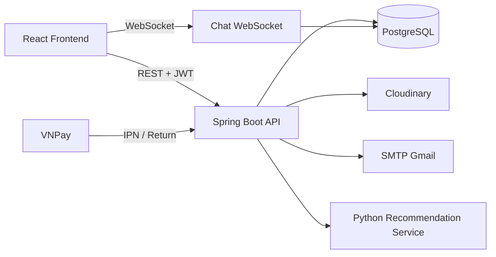
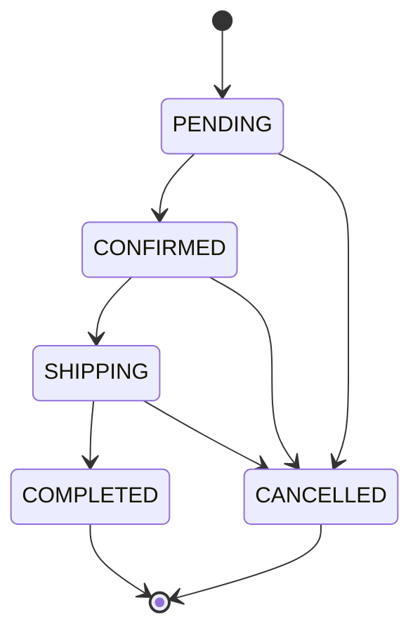
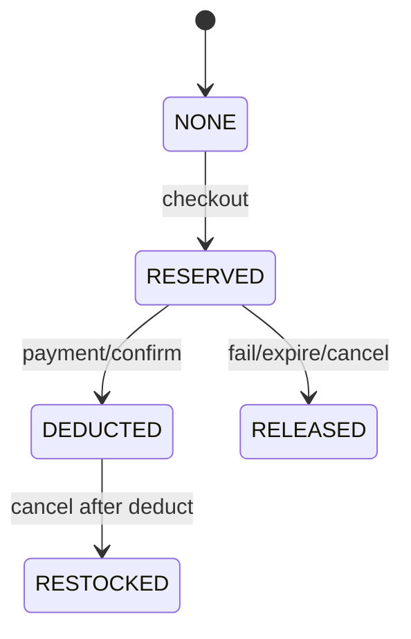

# Book Store — Backend Kick-off

> Trạng thái tài liệu: bản baseline kỹ thuật được đối chiếu với source code ngày 30/07/2026.
> Phạm vi: `bookstore_backend`, PostgreSQL và các tích hợp Cloudinary, VNPay, SMTP, recommendation service.

## 1. Mục đích tài liệu

Tài liệu này là nguồn thống nhất để backend, frontend, QA và DevOps hiểu:

- MVP backend thực sự cung cấp gì.
- Luồng nghiệp vụ, state machine và transaction boundary.
- API, quyền truy cập và mô hình dữ liệu.
- Công nghệ đang dùng, công nghệ còn thiếu và mức ưu tiên bổ sung.
- Tiêu chuẩn bảo mật, kiểm thử, quan sát hệ thống và triển khai.
- Definition of Done cho một backend story.
- Những điểm kỹ thuật đang có rủi ro và cần xử lý trước production.

Tài liệu mô tả đúng hiện trạng trước, sau đó mới đưa ra kiến trúc mục tiêu. Nội dung “đề xuất” không được hiểu là đã tồn tại trong code.

## 2. Nhận xét thẳng về hiện trạng

### 2.1 Điểm làm tốt

- Checkout, payment và inventory đã được đặt trong transaction.
- Checkout khóa cart; cập nhật đơn và IPN khóa bill/payment bằng pessimistic lock.
- Reserve tồn kho dùng conditional update, giảm nguy cơ oversell.
- Callback VNPay kiểm tra chữ ký, merchant, amount, payment method và trạng thái.
- Return URL chỉ đọc kết quả; IPN mới cập nhật dữ liệu thanh toán.
- Refresh token và password-reset token được hash trước khi lưu database.
- Refresh token có rotation và revoke.
- API đã có response envelope, pagination DTO, Bean Validation và exception handler chung.
- Backend đã tách controller, service, repository, DTO và entity ở mức cơ bản.
- Swagger/OpenAPI đã được tích hợp; có thể xem tại `/swagger-ui.html`.

### 2.2 Điểm yếu cần nói rõ

| Mức độ | Vấn đề hiện tại                                                                                          | Tác động                                                                                       | Hành động                                                           |
| --------- | ------------------------------------------------------------------------------------------------------------- | ------------------------------------------------------------------------------------------------- | ---------------------------------------------------------------------- |
| Critical  | Không có migration; ứng dụng dùng`ddl-auto: validate` nhưng repo không chứa schema baseline         | Không thể dựng database mới một cách lặp lại; môi trường dễ drift                     | Bổ sung Flyway và baseline schema trước mọi feature DB mới       |
| Critical  | Refund VNPay chưa có API, entity refund, audit hoặc callback                                               | Không thể hủy đơn VNPay đã thanh toán đúng nghiệp vụ                                  | Thiết kế refund module riêng; ngoài MVP hiện tại                 |
| High      | ERD đang cũ: thiếu`payment`, `inventory` và `bill.inventory_status`                                 | Frontend/QA hiểu sai schema và luồng tồn kho                                                  | Sinh lại ERD sau khi có migration baseline                           |
| High      | Role chat dùng`INVENTOR`, trong khi enum là `WAREHOUSE_KEEPER`                                          | Nhân viên hợp lệ không truy cập được chat; policy không nhất quán                     | Chốt role hỗ trợ chat và sửa controller + WebSocket handler       |
| High      | Access token mặc định 7 ngày                                                                              | Token bị lộ có cửa sổ khai thác quá dài                                                   | Access token 10–30 phút; refresh token 7–30 ngày và rotation      |
| High      | Password reset không revoke refresh token đang tồn tại                                                    | Đổi mật khẩu nhưng session cũ vẫn hoạt động                                             | Revoke toàn bộ refresh token của user khi reset/change password     |
| High      | WebSocket truyền token trong query và cho phép origin`*`                                                 | Token có thể xuất hiện trong URL log; origin không được giới hạn                        | Dùng cookie/subprotocol hoặc ticket ngắn hạn; allowlist origin     |
| High      | Swagger và OpenAPI được public trong mọi môi trường                                                   | Lộ toàn bộ attack surface ở production                                                        | Chỉ bật public ở local/dev; production cần auth hoặc tắt         |
| High      | Chưa cấu hình CORS                                                                                         | Frontend khác origin có thể không gọi được API hoặc team cấu hình tạm thiếu an toàn | Cấu hình allowlist từ biến môi trường                           |
| Medium    | `GlobalExceptionHandler` trả `Exception.getMessage()` cho lỗi 500                                       | Có thể lộ thông tin nội bộ/database                                                         | Log chi tiết server-side, trả message và error code an toàn        |
| Medium    | Reset-password URL hard-code`localhost:3000`                                                                | Email production dẫn sai địa chỉ                                                              | Dùng`APP_FRONTEND_URL`                                              |
| Medium    | Refresh-token expiry hard-code trong Java                                                                     | Không cấu hình theo môi trường                                                              | Đưa vào`application.yml` và validate config                      |
| Medium    | Recommendation dùng`new RestTemplate()` không timeout, retry hay circuit breaker; lỗi ghi `System.err` | Request có thể treo; không quan sát được lỗi tích hợp                                   | Dùng`RestClient` bean, timeout, Resilience4j và structured logging |
| Medium    | `spring.jpa.show-sql: true` mặc định                                                                     | Log nhiễu, có thể lộ dữ liệu và giảm hiệu năng production                               | Chỉ bật trong profile local                                          |
| Medium    | Java 19 không phải LTS                                                                                      | Khó bảo trì và nhận cập nhật dài hạn                                                     | Chuyển Java 21 hoặc Java 25 LTS                                      |
| Medium    | Test hiện tập trung VNPay; thiếu auth, order, inventory concurrency, permission và integration DB         | Regression nghiệp vụ chính khó phát hiện                                                    | Bổ sung test pyramid và Testcontainers PostgreSQL                    |
| Medium    | Chưa có health, metrics, tracing, request ID                                                                | Khó vận hành và điều tra sự cố                                                            | Spring Boot Actuator + Micrometer + structured logs                    |
| Medium    | Chưa có Docker Compose và CI rõ ràng                                                                     | Onboarding và release không lặp lại                                                           | Dockerfile/Compose + pipeline build/test/security scan                 |
| Low       | Package hiện tại thuần layer và service lớn như`BillServiceImpl`                                      | Feature khó sở hữu, class dễ phình to                                                        | Refactor dần sang modular monolith theo domain                        |
| Low       | Naming/ngôn ngữ/error message chưa thống nhất; có typo`PasswordResetServicImpl`                       | Khó tìm kiếm, khó tạo contract frontend ổn định                                           | Chuẩn hóa tiếng Anh trong code và mã lỗi ổn định              |

### 2.3 Kết luận review

Backend có nền nghiệp vụ payment/inventory tốt hơn một CRUD demo thông thường, đặc biệt ở locking và reservation. Tuy nhiên, dự án chưa đạt mức “có thể vận hành production” vì thiếu migration, observability, security hardening, integration test và release pipeline. Ưu tiên đúng không phải là thêm nhiều feature; ưu tiên là làm cho schema, auth, payment và inventory có thể tái lập, kiểm thử và quan sát.

## 3. Mục tiêu MVP backend

### 3.1 Trong phạm vi

- Đăng ký, đăng nhập, refresh token, logout, quên/đặt lại mật khẩu.
- Xem, tìm kiếm, lọc và phân trang sách.
- Quản lý sách và upload ảnh qua Cloudinary.
- Giỏ hàng của người dùng.
- Voucher global hoặc gán theo user.
- Checkout một phần hoặc toàn bộ giỏ.
- Thanh toán `DIRECT` và VNPay Sandbox.
- Giữ hàng, trừ tồn, giải phóng giữ hàng và hoàn kho.
- Lịch sử/chi tiết đơn của user.
- Nhân viên/admin chuyển trạng thái đơn theo state machine.
- Dashboard kế toán: tổng quan, doanh thu theo ngày, sách bán chạy.
- Rating, comment và recommendation.
- Nhập kho cho `WAREHOUSE_KEEPER`.
- OpenAPI/Swagger cho phát triển và kiểm thử.

### 3.2 Ngoài phạm vi MVP

- Refund toàn phần/một phần qua VNPay.
- Customer self-cancel, return merchandise/RMA.
- Shipping provider, shipping fee, tracking number.
- Tax/invoice điện tử.
- Multi-warehouse.
- Event bus, Kafka hoặc microservices.
- Redis distributed cache/lock.
- Full-text search engine như Elasticsearch/OpenSearch.
- Chat production-ready; code hiện tại chỉ nên xem là beta cho đến khi sửa auth/origin/role.

### 3.3 Tiêu chí thành công MVP

- Không oversell khi nhiều request checkout đồng thời.
- Callback VNPay lặp lại không làm xử lý payment hai lần.
- Không user nào xem/sửa dữ liệu riêng của user khác.
- Mọi thay đổi schema có migration và chạy được trên database trắng.
- API contract được sinh tại `/api-docs` và Swagger hoạt động ở local/dev.
- Build, test và security checks chạy tự động trong CI.
- Có health endpoint và log đủ để truy vết một request/payment.

## 4. Kiến trúc hệ thống

### 4.1 Kiến trúc hiện tại

Backend là modular monolith về mặt triển khai nhưng package vẫn đang tổ chức theo technical layer.



### 4.2 Luồng xử lý trong ứng dụng

```text
HTTP request
  → Spring Security / JwtAuthFilter
  → Controller + Bean Validation
  → Application/Domain Service + @Transactional
  → Repository / external integration
  → DTO
  → ApiResponse<T>
```

### 4.3 Kiến trúc mục tiêu cho MVP

Giữ một deployable Spring Boot duy nhất, nhưng chia code theo domain để giảm coupling:

```text
com.bookstore
├─ common
│  ├─ api                 # envelope, error, pagination, request-id
│  ├─ config
│  ├─ security
│  └─ observability
├─ identity               # auth, user, refresh/reset token
├─ catalog                # book, genre, image
├─ cart
├─ promotion              # voucher, user voucher
├─ ordering               # bill, bill detail, state transition
├─ payment                # payment, VNPay, expiry, future refund
├─ inventory              # reserve/deduct/release/restock/import
├─ review                 # rating, comment
├─ dashboard
├─ recommendation
└─ chat
```

Mỗi module nên có cấu trúc:

```text
<module>/
├─ api/                   # controller, request/response DTO
├─ application/           # use case/service
├─ domain/                # entity, enum, domain rule
├─ infrastructure/        # JPA repository, external client
└─ mapper/
```

Không cần refactor toàn bộ một lần. Feature mới đi theo cấu trúc mục tiêu; code cũ được di chuyển khi có thay đổi liên quan và có test bảo vệ.

## 5. Module và trách nhiệm

| Module         | Trách nhiệm                                    | Không nên chịu trách nhiệm |
| -------------- | ------------------------------------------------ | ------------------------------- |
| Identity       | Auth, JWT, refresh/reset token, profile, role    | Order/payment                   |
| Catalog        | Book, genre, tìm kiếm, ảnh                    | Số lượng đã reserve        |
| Cart           | Cart và cart item                               | Chốt giá lịch sử, trừ tồn |
| Promotion      | Voucher, assignment, redeem/release              | Tính payment gateway           |
| Ordering       | Tạo bill, bill detail, order state machine      | Ký request VNPay               |
| Payment        | Payment attempt, IPN, expiry, refund tương lai | Thay đổi catalog              |
| Inventory      | Available/reserved/on-hand, import, restock      | Order authorization             |
| Review         | Rating/comment và quyền sở hữu               | Recommendation model            |
| Dashboard      | Read model/báo cáo                             | Mutation nghiệp vụ            |
| Recommendation | Gọi Python service và fallback                 | Là nguồn dữ liệu sách      |
| Chat           | Room/message, WebSocket authorization            | Quản lý đơn                 |

## 6. Luồng nghiệp vụ chính

### 6.1 Đăng nhập và phiên

```text
POST /api/auth/login
  → kiểm tra email + BCrypt password
  → tạo JWT access token
  → tạo refresh token ngẫu nhiên
  → hash refresh token trước khi lưu
  → trả accessToken + raw refreshToken

POST /api/auth/refresh-token
  → hash token nhận được
  → kiểm tra tồn tại, expiry, revoked
  → revoke token cũ
  → tạo access token + refresh token mới
```

Quyết định cần chốt:

- Access token: đề xuất 15 phút.
- Refresh token: đề xuất 7 ngày cho MVP.
- Reset/change password: revoke toàn bộ refresh token của user.
- Refresh token production: ưu tiên cookie `HttpOnly`, `Secure`, `SameSite`; nếu vẫn trả JSON thì frontend phải có threat model rõ ràng.

### 6.2 Checkout và giữ tồn kho

```text
POST /api/bills/checkout
  → lock cart theo user
  → chọn cart items hợp lệ
  → sort theo bookId để giảm deadlock
  → atomic reserve inventory từng item
  → kiểm tra và đánh dấu voucher
  → snapshot giá vào bill_detail.price_at_purchase
  → tạo bill PENDING / inventory RESERVED
  → tạo payment PENDING
  → xóa item đã checkout khỏi cart
  → nếu VNPAY: ký và trả paymentUrl
  → commit toàn bộ hoặc rollback toàn bộ
```

Yêu cầu bắt buộc:

- Thêm `Idempotency-Key` cho checkout để chống double-click/retry tạo hai đơn.
- Database phải có constraint chống số lượng âm.
- `bill_detail.price_at_purchase` là nguồn lịch sử; không đọc lại giá hiện tại để tính đơn cũ.
- Mọi amount dùng `BigDecimal`; VND được lưu scale 0.

### 6.3 VNPay

```text
Checkout VNPAY
  → Payment PENDING + Bill PENDING + Inventory RESERVED
  → frontend redirect VNPay

VNPay IPN
  → verify HMAC
  → lock Bill và Payment
  → verify method + tmnCode + amount
  → nếu Payment không còn PENDING: trả already confirmed
  → success:
      Payment SUCCEEDED
      Inventory RESERVED → DEDUCTED
      Bill PENDING → CONFIRMED
  → failure:
      Payment FAILED
      Inventory RESERVED → RELEASED
      Bill PENDING → CANCELLED
      release voucher

Expiry scheduler
  → tìm VNPAY PENDING đã hết hạn
  → lock lại và kiểm tra trạng thái
  → release inventory/voucher
  → Payment CANCELLED, Bill CANCELLED
```

Return URL không được dùng làm nguồn xác nhận thanh toán. Chi tiết đầy đủ nằm trong `docs/vnpay-payment-flow.md`.

### 6.4 Đơn hàng



Lưu ý nghiệp vụ hiện tại:

- VNPay thành công tự chuyển bill sang `CONFIRMED`.
- `DIRECT` deduct reservation khi chuyển `PENDING → CONFIRMED`.
- Payment `DIRECT` hiện chỉ chuyển `PENDING → SUCCEEDED` khi order `COMPLETED`. Cần PO xác nhận đây là “thanh toán khi giao thành công” hay “thanh toán trực tiếp tại quầy”.
- Đơn VNPay có payment `SUCCEEDED` hoặc `PARTIALLY_REFUNDED` không được cancel trước khi refund.

### 6.5 Inventory



Khái niệm:

- `quantity_in_stock`: số lượng vật lý/on-hand.
- `reserved_quantity`: lượng đang giữ cho checkout chưa chốt.
- Available = `quantity_in_stock - reserved_quantity`.
- Book hiện cũng lưu `quantity_in_stock`; việc giữ hai bản sao inventory là rủi ro consistency. Trong dài hạn nên chọn bảng `inventory` làm source of truth và loại bỏ/suy ra field trùng ở `book`.

### 6.6 Voucher

- Voucher có scope global hoặc gán user.
- Voucher được đánh dấu used trong cùng transaction checkout.
- Khi payment fail/expire hoặc order cancel, voucher được release.
- Cần unique constraint `(user_id, voucher_id)` và cơ chế atomic claim/use để tránh hai checkout đồng thời dùng cùng voucher.

### 6.7 Recommendation

- Backend gọi Python service qua HTTP.
- Khi service lỗi, fallback sang sách phổ biến.
- Phải cấu hình connect/read timeout; fallback không được biến lỗi downstream thành request treo.
- Cần metric `recommendation.request`, `recommendation.failure`, `recommendation.fallback`.

## 7. State và invariant

### 7.1 Payment state

```text
PENDING → SUCCEEDED
PENDING → FAILED
PENDING → CANCELLED
SUCCEEDED → PARTIALLY_REFUNDED  # chưa triển khai
SUCCEEDED/PARTIALLY_REFUNDED → REFUNDED  # chưa triển khai
```

Invariant:

- `txn_ref` unique.
- VNPay callback chỉ xử lý khi status còn `PENDING`.
- Amount callback bằng `payment.amount × 100`.
- `SUCCEEDED` phải có `paid_at`.
- Tổng refund không vượt payment amount.

### 7.2 Order/payment/inventory consistency

| Trường hợp            | Bill      | Payment                      | Inventory |
| ------------------------ | --------- | ---------------------------- | --------- |
| Vừa checkout VNPay      | PENDING   | PENDING                      | RESERVED  |
| VNPay thành công       | CONFIRMED | SUCCEEDED                    | DEDUCTED  |
| VNPay thất bại         | CANCELLED | FAILED                       | RELEASED  |
| VNPay hết hạn          | CANCELLED | CANCELLED                    | RELEASED  |
| DIRECT đã xác nhận   | CONFIRMED | PENDING theo code hiện tại | DEDUCTED  |
| DIRECT giao thành công | COMPLETED | SUCCEEDED                    | DEDUCTED  |
| Hủy sau khi đã deduct | CANCELLED | phụ thuộc method/status    | RESTOCKED |

Các tổ hợp ngoài bảng phải được xem là inconsistent state và phát cảnh báo.

## 8. API contract

### 8.1 Quy ước chung

- Base path hiện tại: `/api`.
- Đề xuất feature mới dùng version `/api/v1`; không đổi endpoint cũ mà không có kế hoạch deprecation.
- JSON dùng `camelCase`.
- Date/time trả ISO-8601; persistence và log chuẩn UTC.
- Money trả JSON number hoặc string theo một quy ước duy nhất; frontend không dùng floating point để cộng tiền.
- Collection lớn bắt buộc phân trang.
- Không trả JPA entity trực tiếp.
- Mọi endpoint được mô tả trong OpenAPI: summary, response codes, security, example.
- Mọi mutation quan trọng có audit context: actor, request ID, entity ID, trạng thái trước/sau.

Response hiện tại:

```json
{
  "success": true,
  "statusCode": 200,
  "message": "Books fetched successfully",
  "data": {}
}
```

Error contract mục tiêu:

```json
{
  "success": false,
  "statusCode": 409,
  "code": "INVENTORY_NOT_AVAILABLE",
  "message": "Sách không đủ tồn kho",
  "requestId": "01J...",
  "fieldErrors": [
    { "field": "quantity", "code": "POSITIVE", "message": "Số lượng phải lớn hơn 0" }
  ]
}
```

Frontend không nên phụ thuộc vào text `message`; cần `code` ổn định.

### 8.2 Endpoint inventory theo module

| Module         | Method và endpoint chính                                                   | Access                  |
| -------------- | ---------------------------------------------------------------------------- | ----------------------- |
| Auth           | `POST /api/auth/register`                                                  | Public                  |
| Auth           | `POST /api/auth/login`                                                     | Public                  |
| Auth           | `POST /api/auth/refresh-token`                                             | Public, rate-limited    |
| Auth           | `POST /api/auth/forgot-password`                                           | Public, rate-limited    |
| Auth           | `POST /api/auth/reset-password`                                            | Public, rate-limited    |
| User           | `GET/PUT /api/user/me`                                                     | Authenticated           |
| User           | `PATCH /api/user/me/password`                                              | Authenticated           |
| User           | `POST /api/user/logout`                                                    | Authenticated           |
| Catalog        | `GET /api/public/books`                                                    | Public                  |
| Catalog        | `GET /api/public/books/{bookId}`                                           | Public                  |
| Catalog admin  | `POST /api/admin/books`                                                    | ADMIN                   |
| Catalog admin  | `PUT/DELETE /api/admin/books/{bookId}`                                     | ADMIN                   |
| Cart           | `GET/POST /api/carts`                                                      | Authenticated           |
| Cart           | `GET/POST /api/carts/cartDetails`                                          | Authenticated           |
| Cart           | `PUT .../{bookId}/increase`, `PUT .../decrease`, `DELETE .../{bookId}` | Authenticated           |
| Checkout       | `POST /api/bills/checkout`                                                 | Authenticated           |
| Order user     | `GET /api/bills/me`, `GET /api/bills/me/{billId}`                        | Owner                   |
| Order admin    | `GET /api/admin/bills[/{billId}]`, `PATCH .../status`                    | ADMIN                   |
| Order staff    | `GET /api/dashboard/staff/orders[/{billId}]`, status/delivery mutation     | STAFF, ADMIN            |
| Payment        | `GET /api/payments/vnpay/ipn`                                              | Public callback, signed |
| Payment        | `GET /api/payments/vnpay/return`                                           | Public, read-only       |
| Voucher        | `GET /api/vouchers/me`                                                     | Authenticated           |
| Voucher admin  | `GET/POST /api/admin/vouchers`                                             | ADMIN                   |
| Review         | Public GET; authenticated POST/PUT/DELETE ratings/comments                   | Public/owner            |
| Recommendation | Similar public; personalized authenticated                                   | Public/authenticated    |
| Dashboard      | `/api/dashboard/accountant/**`                                             | ACCOUNTANT, ADMIN       |
| Stock          | `PATCH /api/stock/books/{bookId}`                                          | WAREHOUSE_KEEPER        |
| Chat           | `/api/chat/**`, `/ws/chat`                                               | Beta; policy cần sửa  |

### 8.3 Pagination

Query chuẩn:

```text
?page=0&size=20&sort=createdAt,desc
```

Response:

```json
{
  "content": [],
  "page": 0,
  "size": 20,
  "totalElements": 0,
  "totalPages": 0,
  "first": true,
  "last": true,
  "hasNext": false,
  "hasPrevious": false
}
```

Giới hạn `size` tối đa, đề xuất 100, để tránh request làm cạn bộ nhớ.

## 9. Quyền theo role

Role trong enum hiện tại: `USER`, `CLONE`, `ADMIN`, `ACCOUNTANT`, `STAFF`, `WAREHOUSE_KEEPER`.

| Capability                             |  USER |                              STAFF |          ADMIN |                         ACCOUNTANT |                   WAREHOUSE_KEEPER |       CLONE |
| -------------------------------------- | ----: | ---------------------------------: | -------------: | ---------------------------------: | ---------------------------------: | ----------: |
| Profile/cart/checkout/order của mình |    ✓ | Theo rule authenticated hiện tại |             ✓ | Theo rule authenticated hiện tại | Theo rule authenticated hiện tại | Chưa chốt |
| Review/comment của mình              |    ✓ |                                 ✓ |             ✓ |                                 ✓ |                                 ✓ | Chưa chốt |
| Xử lý đơn                          |    — |                                 ✓ |             ✓ |                                 — |                                 — |          — |
| CRUD sách/voucher                     |    — |                                 — |             ✓ |                                 — |                                 — |          — |
| Dashboard tài chính                  |    — |                                 — |             ✓ |                                 ✓ |                                 — |          — |
| Nhập kho                              |    — |                                 — |             — |                                 — |                                 ✓ |          — |
| Chat hỗ trợ                          | Buyer |    Dự kiến nhưng code chưa cho | Có một phần |                                 — |           Code dùng sai tên role |          — |

Vấn đề cần quyết định:

- `CLONE` là role gì, có được đăng nhập production không?
- Các endpoint cart/checkout hiện cho mọi authenticated role. Nếu tài khoản vận hành không được phép mua hàng, cần thêm `hasRole('USER')`.
- Chốt STAFF hay WAREHOUSE_KEEPER là nhân sự chat.
- Authorization phải được test ở controller/service, không chỉ ẩn nút ở frontend.

## 10. Database

### 10.1 Hiện trạng

PostgreSQL là database chính. JPA/Hibernate chỉ validate schema. Repo hiện không có migration, vì vậy không thể xác định schema source of truth bằng Git.

ERD hiện có mô tả 16 bảng nhưng code thực tế đã có ít nhất 18 aggregate/table:

```text
user, book, genre, book_genre,
cart, cart_detail,
voucher, user_voucher,
bill, bill_detail,
payment, inventory,
rating, comment,
chat_room, chat_message,
refresh_tokens, password_reset_tokens
```

### 10.2 Migration bắt buộc

Thêm Flyway:

```text
src/main/resources/db/migration/
├─ V001__baseline.sql
├─ V002__add_payment_and_inventory.sql
├─ V003__add_constraints_and_indexes.sql
└─ V004__seed_reference_data.sql
```

Quy tắc:

- Migration đã merge không được sửa; tạo migration mới.
- Không dùng `ddl-auto: update`.
- CI chạy migration trên PostgreSQL thật qua Testcontainers.
- Startup production chạy `validate`/`migrate` theo chiến lược deploy đã chốt.
- Backup và rollback plan phải tồn tại cho migration phá vỡ tương thích.

### 10.3 Constraint/index tối thiểu

- Unique: `user.email`, `book.isbn`, `voucher.code`, `payment.txn_ref`, token hash.
- Unique: `user_voucher(user_id, voucher_id)`, `rating(user_id, book_id)` nếu mỗi user chỉ rate một lần.
- Check: quantity và reserved không âm; `reserved_quantity <= quantity_in_stock`.
- Check: price/amount không âm; rating trong 1–5; discount trong `(0, 100]`.
- Index FK và query nóng: bill user/status/created_at, payment bill/status/expires_at, cart user, reviews book, chat room/created_at.
- Partial index cho payment pending expiry nếu PostgreSQL query plan cho thấy cần thiết.

### 10.4 Transaction và concurrency

- Lock order nhất quán: cart → inventory theo book ID → bill → payment.
- External network call không nên giữ database transaction lâu. Việc tạo URL VNPay chỉ là local signing nên chấp nhận; upload Cloudinary/email nên tách khỏi transaction DB hoặc dùng outbox/job.
- Scheduler phải an toàn khi chạy nhiều instance. Pessimistic lock từng payment giúp một phần nhưng cần batch size, `SKIP LOCKED` hoặc distributed scheduling strategy khi scale.
- Checkout cần idempotency record; payment/refund cần idempotency theo gateway transaction.

## 11. Công nghệ

### 11.1 Đang sử dụng

| Nhóm          | Công nghệ                                     | Trạng thái                      |
| -------------- | ----------------------------------------------- | --------------------------------- |
| Runtime        | Java 19                                         | Có; nên đổi LTS               |
| Framework      | Spring Boot 4.1, Spring MVC                     | Có                               |
| Security       | Spring Security, JJWT, BCrypt                   | Có                               |
| Persistence    | Spring Data JPA/Hibernate, PostgreSQL, HikariCP | Có                               |
| Validation     | Jakarta Bean Validation                         | Có                               |
| API docs       | springdoc-openapi/Swagger UI                    | Có                               |
| Realtime       | Spring WebSocket                                | Có, cần hardening               |
| Payment        | VNPay HMAC-SHA512 integration                   | Có cho payment, chưa có refund |
| Media          | Cloudinary SDK                                  | Có                               |
| Email          | Spring Mail/SMTP Gmail                          | Có                               |
| Recommendation | Python HTTP service                             | Có fallback, thiếu resilience   |
| Build          | Maven Wrapper                                   | Có                               |
| Test           | Spring test starters, JUnit/Mockito             | Có nhưng coverage thấp         |

Spring Boot 4.1 hỗ trợ Java 17–26. Dự án nên chọn Java 21 hoặc 25 LTS thay vì Java 19 để ổn định toolchain.

### 11.2 Công nghệ cần bổ sung — P0 trước production

| Công nghệ                        | Mục đích                             | Ghi chú áp dụng                                                         |
| ---------------------------------- | --------------------------------------- | -------------------------------------------------------------------------- |
| Flyway                             | Version hóa schema                     | Baseline database hiện tại rồi bắt buộc migration cho mọi thay đổi |
| Testcontainers PostgreSQL          | Integration test đúng dialect/locking | Không dùng H2 để test inventory/payment concurrency                    |
| Spring Boot Actuator               | Health/readiness/liveness/metrics       | Chỉ expose endpoint cần thiết và bảo vệ endpoint nhạy cảm          |
| Micrometer + Prometheus registry   | Metrics JVM, HTTP, DB pool, payment     | Dashboard bằng Grafana hoặc nền tảng tương đương                  |
| Docker + Docker Compose            | Môi trường local lặp lại           | Backend, PostgreSQL, recommendation, Mailpit                               |
| Mailpit                            | Kiểm thử email local                  | Không gửi Gmail thật khi phát triển/test                              |
| JaCoCo                             | Báo cáo test coverage                 | Dùng quality gate có ý nghĩa, không chạy theo tỷ lệ hình thức    |
| Spotless hoặc Checkstyle          | Chuẩn hóa format/style                | Chọn một, chạy trong CI                                                 |
| SpotBugs + OWASP dependency-check  | Static/dependency security scan         | Có policy xử lý CVE và false positive                                  |
| GitHub Actions/CI tương đương | Build, test, migration, scan            | Không release nếu pipeline đỏ                                          |

### 11.3 Công nghệ nên bổ sung — P1

| Công nghệ                        | Mục đích                            | Khi dùng                                                            |
| ---------------------------------- | -------------------------------------- | -------------------------------------------------------------------- |
| Resilience4j                       | Timeout/retry/circuit breaker/bulkhead | Recommendation, Cloudinary, email; không retry mù mutation VNPay   |
| WireMock                           | Stub external HTTP                     | Test recommendation/VNPay-related HTTP contract                      |
| Bucket4j hoặc gateway rate limit  | Chống brute force/abuse               | Login, forgot/reset, refresh, review/comment, callback               |
| Structured JSON logging            | Tìm kiếm log theo request/payment    | Logback JSON encoder hoặc platform agent                            |
| Micrometer Tracing + OpenTelemetry | Distributed trace                      | Khi cần nối frontend/API/recommendation                            |
| Awaitility                         | Test scheduler/async                   | Payment expiry, cleanup jobs                                         |
| ArchUnit                           | Giữ module boundary                   | Ngăn controller gọi repository trực tiếp/cross-module tùy tiện |

### 11.4 Chưa cần cho MVP

- Kafka/RabbitMQ: chỉ thêm khi thực sự cần async delivery/outbox scale.
- Redis: chưa cần nếu một instance và tải nhỏ; cân nhắc cho rate limit/cache/session ticket khi scale.
- Elasticsearch/OpenSearch: PostgreSQL search đủ cho MVP.
- Kubernetes: Docker deployment đơn giản phù hợp hơn ở giai đoạn hiện tại.
- MapStruct: hữu ích khi DTO mapping lớn nhưng không phải blocker.

## 12. Cấu hình và environment

### 12.1 Biến hiện có

| Biến                                                                  |             Bắt buộc | Ý nghĩa           |
| ---------------------------------------------------------------------- | ---------------------: | ------------------- |
| `DB_URL`, `DB_USERNAME`, `DB_PASSWORD`                           |                     ✓ | PostgreSQL          |
| `JWT_SECRET_KEY`                                                     |                     ✓ | Base64 HMAC secret  |
| `JWT_ACCESS_TOKEN_EXPIRATION`                                        |            Có default | Milliseconds        |
| `MAIL_USERNAME`, `MAIL_PASSWORD`                                   |     ✓ cho reset email | SMTP credential     |
| `CLOUDINARY_NAME`, `CLOUDINARY_API_KEY`, `CLOUDINARY_API_SECRET` |                     ✓ | Upload ảnh         |
| `VNPAY_TMN_CODE`, `VNPAY_HASH_SECRET`                              |           ✓ cho VNPay | Merchant credential |
| `VNPAY_PAYMENT_URL`, `VNPAY_RETURN_URL`, `VNPAY_EXPIRE_MINUTES`  | Có default một phần | VNPay config        |
| `PAYMENT_EXPIRY_CHECK_DELAY_MS`                                      |            Có default | Scheduler delay     |
| `RECOMMENDATION_SERVICE_URL`                                         |            Có default | Python service      |

### 12.2 Biến cần thêm

```text
APP_ENV
APP_FRONTEND_URL
APP_ALLOWED_ORIGINS
JWT_REFRESH_TOKEN_EXPIRATION
SWAGGER_ENABLED
MANAGEMENT_ENDPOINTS_ENABLED
RECOMMENDATION_CONNECT_TIMEOUT
RECOMMENDATION_READ_TIMEOUT
LOG_LEVEL_ROOT
OTEL_EXPORTER_OTLP_ENDPOINT
```

Không commit `.env`, secret, token hoặc credential. Tạo `.env.example` chỉ chứa key và giá trị mẫu vô hại.

### 12.3 Profile

```text
application.yml           # default an toàn
application-local.yml     # show SQL, Swagger public, Mailpit
application-test.yml      # Testcontainers/dynamic properties
application-prod.yml      # Swagger restricted, no show-sql, strict origin
```

## 13. Bảo mật

### 13.1 Checklist bắt buộc

- Access token ngắn hạn; refresh rotation và hash at rest.
- Revoke tất cả refresh token khi password đổi/reset hoặc account bị khóa.
- Không log password, raw refresh/reset token, JWT, VNPay hash secret.
- Validate issuer/audience nếu hệ thống có nhiều consumer.
- CORS allowlist theo môi trường.
- Swagger production tắt hoặc yêu cầu admin/VPN.
- Rate limit endpoint auth và content mutation.
- Giới hạn kích thước/ràng buộc loại file upload trước Cloudinary.
- Không tin `X-Forwarded-For` trừ khi request đến từ trusted proxy.
- WebSocket xác thực origin và không truyền long-lived token trong URL.
- Generic 500 response; request ID nối với internal log.
- Secret lấy từ deployment secret manager, không chỉ `.env`.
- Security headers và HTTPS bắt buộc ở production.
- Dependency scan và secret scan trong CI.

### 13.2 CSRF

CSRF disabled phù hợp khi API chỉ nhận Bearer token trong header. Nếu refresh token chuyển sang cookie, phải đánh giá lại CSRF và dùng `SameSite`/CSRF token phù hợp.

### 13.3 VNPay

- IPN public nhưng phải verify signature trước mutation.
- So sánh merchant, amount, transaction reference và trạng thái.
- Không tin return URL.
- Ghi audit tối thiểu cho callback nhưng không log secret.
- Refund phải có authorization riêng cho ACCOUNTANT/ADMIN, maker-checker nếu business yêu cầu.

## 14. Observability và vận hành

### 14.1 Logging

Mỗi request có:

```text
timestamp, level, service, environment,
requestId/traceId, method, path, status, durationMs,
userId (nếu có), billId/paymentId/txnRef (nếu liên quan)
```

Không dùng `System.out/err`. Log exception bằng logger có stack trace; response chỉ trả message an toàn.

### 14.2 Metrics tối thiểu

- HTTP request count/latency/error theo route.
- JVM memory/GC/thread.
- Hikari active/pending connection.
- Checkout success/conflict/duration.
- Inventory reserve conflict.
- VNPay IPN valid/invalid/success/failure/duplicate.
- Pending payment expired.
- Recommendation success/fallback/latency.
- Email send success/failure.
- Scheduler duration và last-success timestamp.

### 14.3 Health

- Liveness: process hoạt động.
- Readiness: database kết nối; không nhất thiết fail chỉ vì recommendation/SMTP tạm lỗi nếu có fallback.
- Không public chi tiết health chứa credential/host nội bộ.

### 14.4 Alert gợi ý

- Tỷ lệ HTTP 5xx tăng.
- VNPay invalid signature tăng bất thường.
- Hikari pending connection > 0 kéo dài.
- Payment PENDING quá expiry nhưng chưa được xử lý.
- Inventory invariant bị vi phạm.
- Recommendation fallback tăng cao.
- Scheduler không thành công trong nhiều chu kỳ.

## 15. Kiểm thử

### 15.1 Test pyramid

| Lớp test         | Công cụ                                     | Phạm vi                                                |
| ----------------- | --------------------------------------------- | ------------------------------------------------------- |
| Unit              | JUnit 5, Mockito                              | State transition, amount, voucher, auth rule            |
| Web slice         | Spring MVC Test                               | Validation, status code, role/access, JSON contract     |
| Repository        | Testcontainers PostgreSQL                     | Native query, lock, constraint, index-sensitive query   |
| Integration       | `@SpringBootTest` + Testcontainers          | Checkout/payment/inventory transaction                  |
| External contract | WireMock                                      | Recommendation, email adapter, callback samples         |
| Concurrency       | Executor + PostgreSQL container               | Hai checkout cùng sách, duplicate IPN, scheduler race |
| E2E smoke         | Newman/REST Assured hoặc frontend Playwright | Login → cart → checkout → order                      |

### 15.2 Test case P0

- Register duplicate email; login sai password; deleted/disabled user.
- Refresh rotate thành công; reuse token cũ thất bại; expired/revoked token.
- Reset password một lần; expired token; session cũ bị revoke.
- User A không đọc/sửa order/review/comment của user B.
- Hai request reserve sản phẩm cuối cùng: đúng một request thành công.
- Checkout rollback hoàn toàn khi một item thiếu tồn.
- Voucher không bị dùng hai lần khi concurrent checkout.
- VNPay signature/merchant/amount sai không mutation DB.
- Duplicate VNPay IPN không deduct stock lần hai.
- Payment expiry và IPN chạy đồng thời vẫn tạo một trạng thái hợp lệ.
- Mỗi order transition hợp lệ và mọi transition sai trả 409.
- Dashboard chỉ tính order `COMPLETED` theo business rule.

### 15.3 Quality gate đề xuất

- Compile, unit và integration test đều pass.
- Không có high/critical vulnerability chưa được chấp thuận.
- Code mới ở luồng nghiệp vụ quan trọng có branch coverage phù hợp.
- OpenAPI generation không lỗi.
- Migration chạy được từ database trắng và upgrade từ baseline gần nhất.

## 16. CI/CD

Pipeline pull request:

```text
checkout
  → setup LTS JDK
  → ./mvnw spotless/checkstyle check
  → unit tests
  → integration tests + Testcontainers PostgreSQL
  → JaCoCo report
  → dependency/static/secret scan
  → package
  → build container
```

Pipeline deploy:

```text
immutable image
  → migrate/validate schema
  → deploy staging
  → smoke test + OpenAPI check
  → approval
  → deploy production
  → readiness check
  → monitor error/latency/payment metrics
```

Không build lại artifact giữa staging và production.

## 17. Local development

Mục tiêu onboarding:

```powershell
Copy-Item .env.example .env
docker compose up -d postgres mailpit recommendation
Set-Location bookstore_backend
.\mvnw.cmd spring-boot:run
```

Các URL local dự kiến:

```text
API:          http://localhost:8080
Swagger UI:   http://localhost:8080/swagger-ui.html
OpenAPI JSON: http://localhost:8080/api-docs
Mailpit:      http://localhost:8025
Recommender:  http://localhost:8000
```

Hiện repo chưa có đầy đủ `.env.example`, Compose và Mailpit; đây là target onboarding, không phải lệnh đã bảo đảm chạy ngay.

## 18. Definition of Done

Một backend story chỉ hoàn thành khi:

- Acceptance criteria và business invariant được mô tả.
- Endpoint có request/response DTO; không expose entity.
- Validation, authorization và ownership check đầy đủ.
- Error có HTTP status và error code ổn định.
- Transaction boundary được xác định; concurrency/idempotency được xem xét.
- Schema change có Flyway migration, constraint và index phù hợp.
- OpenAPI cập nhật, có security/response/example.
- Unit test và integration test cho happy path + failure path.
- Không log secret/PII nhạy cảm; có audit cho mutation quan trọng.
- Metrics/log cần thiết đã được thêm cho luồng vận hành.
- Build, test, format và security scan pass.
- API thay đổi breaking đã được frontend/QA xác nhận và có migration/deprecation plan.
- Tài liệu liên quan được cập nhật.

### DoD riêng cho payment/inventory

- Test duplicate request/callback.
- Test rollback khi lỗi giữa transaction.
- Test concurrent access trên PostgreSQL thật.
- Không có tổ hợp Bill/Payment/Inventory invalid sau commit.
- Có metric và audit theo `txnRef`.
- Có cách reconcile payment với gateway.

## 19. Kế hoạch triển khai kỹ thuật

### Phase 0 — Baseline và sửa lỗi contract

- Chốt role, sửa `INVENTOR`/`WAREHOUSE_KEEPER`.
- Chốt nghĩa `DIRECT`, `CLONE` và actor được phép chat.
- Cập nhật ERD với payment/inventory.
- Chuẩn hóa error code và không leak 500.
- CORS allowlist; Swagger theo profile.

### Phase 1 — Database và test

- Thêm Flyway baseline.
- Bổ sung constraint/index.
- Thêm Testcontainers PostgreSQL.
- Viết concurrency tests cho checkout/IPN/expiry.
- Thêm checkout idempotency.

### Phase 2 — Security

- Chuyển LTS JDK.
- Giảm access-token TTL.
- Revoke session khi đổi/reset password.
- Rate limit auth.
- Sửa WebSocket token/origin.
- Secret/dependency scan.

### Phase 3 — Operations

- Actuator, Micrometer, Prometheus/OTel.
- Structured log + request ID.
- Docker Compose local và immutable production image.
- CI/CD và staging smoke test.

### Phase 4 — Feature sau MVP

- Refund VNPay + audit/reconciliation.
- Chat production-ready.
- Notification/outbox.
- Shipping/return workflow.

## 20. Quyết định cần PO/Tech Lead xác nhận

1. `DIRECT` là trả tại quầy hay COD khi giao thành công?
2. User có được tự hủy đơn không, và ở trạng thái nào?
3. Refund thuộc ADMIN, ACCOUNTANT hay cần hai bước phê duyệt?
4. `CLONE` dùng cho mục đích gì?
5. STAFF hay WAREHOUSE_KEEPER chịu trách nhiệm chat?
6. Có cho nhân viên vận hành dùng chức năng mua hàng bằng cùng account không?
7. `inventory` hay `book.quantity_in_stock` là source of truth?
8. SLA cho payment callback, checkout và recommendation là bao nhiêu?
9. Chính sách giữ reservation VNPay là 15 phút hay giá trị khác?
10. Dữ liệu/backup cần giữ trong bao lâu?

## 21. Tài liệu liên quan

- `docs/frontend-kickoff.md`
- `docs/vnpay-payment-flow.md`
- `docs/database-erd.md`
- `docs/database-uml.puml`
- Swagger UI: `/swagger-ui.html`
- OpenAPI JSON: `/api-docs`
- Spring Boot 4.1 system requirements: [https://docs.spring.io/spring-boot/system-requirements.html](https://docs.spring.io/spring-boot/system-requirements.html)
- Spring Boot observability: [https://docs.spring.io/spring-boot/reference/actuator/observability.html](https://docs.spring.io/spring-boot/reference/actuator/observability.html)
- Spring Boot metrics: [https://docs.spring.io/spring-boot/reference/actuator/metrics.html](https://docs.spring.io/spring-boot/reference/actuator/metrics.html)
- Flyway migrations: [https://documentation.red-gate.com/flyway/flyway-concepts/migrations](https://documentation.red-gate.com/flyway/flyway-concepts/migrations)
