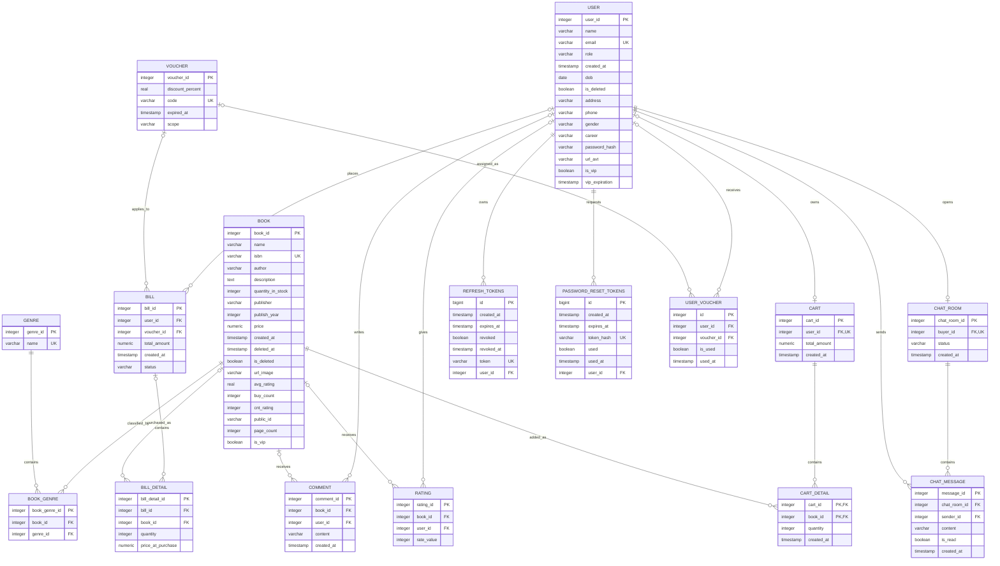

# Bookstore PostgreSQL ERD

Nguồn: schema `public` được đọc trực tiếp từ PostgreSQL.

## Phạm vi

- 16 bảng trong schema `public`.
- Sơ đồ thể hiện primary key, foreign key, unique key và kiểu dữ liệu PostgreSQL.
- Nullability được dùng để xác định phía quan hệ là bắt buộc hay tùy chọn.
- File PlantUML đầy đủ: [`database-uml.puml`](database-uml.puml).
