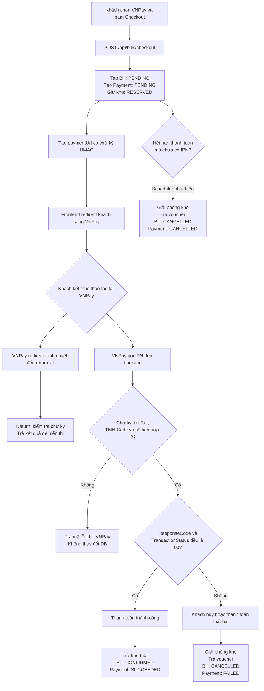
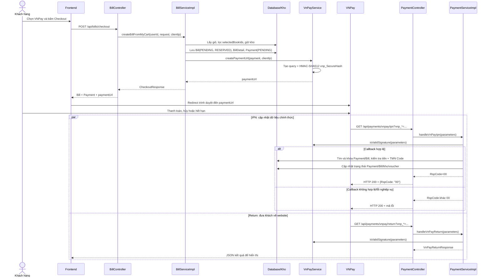
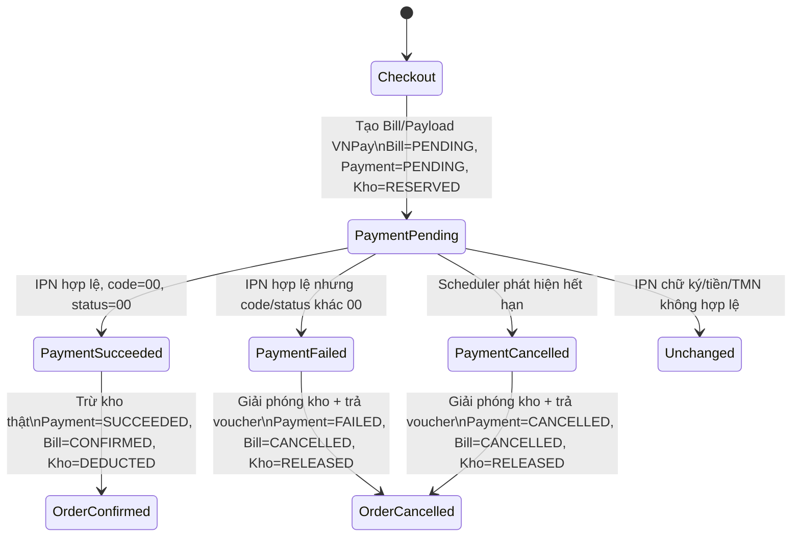

# Luồng thanh toán VNPay

Tài liệu này mô tả luồng đang được cài đặt trong backend Book Store: từ checkout, tạo `Bill`/`Payment`, chuyển khách sang VNPay, nhận IPN, xử lý thành công/thất bại và tự hủy giao dịch hết hạn.

## 1. Thành phần tham gia

| Thành phần | Vai trò |
|---|---|
| Frontend | Gọi checkout, nhận `paymentUrl`, điều hướng trình duyệt khách sang VNPay và hiển thị kết quả. |
| `BillController` | Nhận `POST /api/bills/checkout`. |
| `BillServiceImpl` | Tạo Bill, BillDetail, Payment, giữ kho và tạo URL VNPay. |
| `VnPayService` | Tạo query VNPay, ký HMAC-SHA512 và kiểm tra chữ ký callback. |
| VNPay | Hiển thị màn hình thanh toán, xử lý giao dịch, gọi IPN và redirect trình duyệt về return URL. |
| `PaymentController` | Nhận IPN và return callback từ VNPay. |
| `PaymentServiceImpl` | Xác thực IPN, cập nhật Bill/Payment/kho/voucher. |
| `PaymentExpiryJob` | Định kỳ hủy Payment VNPay hết hạn. |

## 2. Dữ liệu/cấu hình VNPay cần có

```properties
vnpay.tmn-code=${VNPAY_TMN_CODE}
vnpay.hash-secret=${VNPAY_HASH_SECRET}
vnpay.payment-url=https://sandbox.vnpayment.vn/paymentv2/vpcpay.html
vnpay.return-url=https://api.example.com/api/payments/vnpay/return
vnpay.expire-minutes=15
```

- `tmnCode`: mã merchant do VNPay cấp; được gửi dưới tên `vnp_TmnCode`.
- `hashSecret`: khóa bí mật chung do VNPay cấp; chỉ lưu ở backend. Nó dùng để ký/kiểm tra `vnp_SecureHash`, không được gửi trong URL, log, frontend hoặc Git.
- `paymentUrl`: địa chỉ cổng thanh toán Sandbox/Production.
- `returnUrl`: địa chỉ trình duyệt khách quay về sau khi kết thúc thao tác ở VNPay.

`HashSecret` không mã hóa query. Nó tạo chữ ký:

```text
vnp_SecureHash = HMAC_SHA512(hashSecret, query-da-sap-xep-va-url-encode)
```

Query vẫn có thể đọc được; HTTPS/TLS mới mã hóa dữ liệu trên đường truyền. Chữ ký HMAC chứng minh người gửi biết `HashSecret` và phát hiện query bị sửa.

## 3. Sơ đồ cây nhìn nhanh



## 4. Sơ đồ tuần tự toàn bộ luồng



IPN và return là hai request độc lập; không được giả định cái nào đến trước. IPN cập nhật database là nguồn trạng thái chính thức. Return chỉ phục vụ trải nghiệm người dùng.

## 5. Bước checkout: tạo Bill và Payment

Điểm vào: `BillController.createBillFromMyCart(...)` trong `controller/BillController.java`.

Nó gọi `BillServiceImpl.createBillFromMyCart(...)` trong `services/impl/BillServiceImpl.java`.

### 5.1. Kiểm tra và giữ dữ liệu trước thanh toán

1. Đổi `request.paymentMethod` thành enum `PaymentMethod.VNPAY`.
2. Lấy và khóa giỏ hàng của người dùng.
3. Lấy `CartDetail`, lọc theo `request.selectedBookIds` bằng `selectCartDetails(...)`.
4. Gọi `inventoryService.reserveCartDetails(selectedCartDetails)`:
   - tăng `inventory.reservedQuantity`;
   - chưa giảm `inventory.quantityInStock`;
   - ngăn khách khác mua vượt tồn khả dụng.
5. Kiểm tra voucher bằng `findUsableVoucher(...)`, tính subtotal và giảm giá.

### 5.2. Tạo Bill và BillDetail

Backend lưu:

```text
Bill.status          = PENDING
Bill.inventoryStatus = RESERVED
Bill.totalAmount     = tiền sau giảm giá
```

Mỗi sách được chọn tạo một `BillDetail` gồm `Bill`, `Book`, `quantity` và `priceAtPurchase`.

### 5.3. Tạo Payment

`createPayment(savedBill, PaymentMethod.VNPAY, request.getBankCode())` tạo Payment:

| Field Payment | Ý nghĩa |
|---|---|
| `bill` | Bill mà Payment thuộc về. |
| `amount` | `bill.totalAmount`, tính bằng VND. |
| `status` | Ban đầu là `PENDING`. |
| `paymentMethod` | `VNPAY`. |
| `txnRef` | Mã tham chiếu duy nhất do hệ thống sinh; gửi đi là `vnp_TxnRef`. |
| `orderInfo` | Nội dung thanh toán; gửi đi là `vnp_OrderInfo`. |
| `vnpCreateDate` | Thời điểm tạo giao dịch; gửi đi là `vnp_CreateDate`. |
| `expiresAt` | Hạn thanh toán; gửi đi là `vnp_ExpireDate`. |
| `bankCode` | Tùy chọn; gửi đi là `vnp_BankCode` nếu có. |

Sau checkout, voucher (nếu có) được đánh dấu đã dùng và các sản phẩm đã checkout bị xóa khỏi giỏ.

## 6. Tạo URL VNPay

`BillServiceImpl` gọi:

```java
vnPayService.createPaymentUrl(savedPayment, normalizeIp(clientIp))
```

`VnPayService.createPaymentUrl(...)` tạo các tham số chính:

| Tham số VNPay | Nguồn |
|---|---|
| `vnp_Version` | Hằng số `2.1.0`. |
| `vnp_Command` | Hằng số `pay`. |
| `vnp_TmnCode` | `VnPayProperties.tmnCode`. |
| `vnp_Amount` | `Payment.amount × 100`; ví dụ 150.000 VND thành `15000000`. |
| `vnp_CurrCode` | `VND`. |
| `vnp_TxnRef` | `Payment.txnRef`. |
| `vnp_OrderInfo` | `Payment.orderInfo`. |
| `vnp_OrderType` | Mã loại hàng hóa đã cấu hình trong code. |
| `vnp_Locale` | `vn`. |
| `vnp_ReturnUrl` | `VnPayProperties.returnUrl`. |
| `vnp_IpAddr` | IP khách. |
| `vnp_CreateDate` | `Payment.vnpCreateDate`. |
| `vnp_ExpireDate` | `Payment.expiresAt`. |
| `vnp_BankCode` | Chỉ thêm khi `Payment.bankCode` có giá trị. |

Các bước ký URL:

```text
TreeMap sắp xếp key
  → URL encode key/value
  → nối bằng & thành query
  → HMAC-SHA512(query, hashSecret)
  → thêm vnp_SecureHash vào URL
```

Frontend nhận `CheckoutResponse.paymentUrl` rồi redirect khách sang URL đó.

## 7. IPN: luồng chính thức cập nhật thanh toán

VNPay gọi server-to-server:

```text
GET /api/payments/vnpay/ipn?vnp_TxnRef=...&vnp_Amount=...&vnp_SecureHash=...
```

Điểm vào: `PaymentController.ipn(...)` trong `controller/PaymentController.java`.

Controller gọi `PaymentServiceImpl.handleVnPayIpn(parameters)`.

### 7.1. Các bước kiểm tra IPN

1. `vnPayService.isValidSignature(parameters)`.
   - Lấy `vnp_SecureHash` VNPay gửi về.
   - Lọc các key bắt đầu bằng `vnp_`.
   - Loại `vnp_SecureHash` và `vnp_SecureHashType`.
   - Bỏ value null/rỗng, sắp xếp bằng `TreeMap`.
   - Tạo lại query và HMAC-SHA512 bằng `hashSecret` nội bộ.
   - So sánh chữ ký tự tính với chữ ký VNPay gửi.
2. Lấy `vnp_TxnRef`, tìm Payment bằng `paymentRepository.findByTxnRef(txnRef)`.
3. Khóa Bill và Payment bằng `findByIdForUpdate(...)`, `findByTxnRefForUpdate(...)` để tránh xử lý song song/trùng callback.
4. Kiểm tra Payment thuộc `PaymentMethod.VNPAY`.
5. Kiểm tra `vnp_TmnCode` bằng merchant code cấu hình.
6. Kiểm tra `vnp_Amount` có bằng `Payment.amount × 100` không.
7. Payment phải còn `PENDING`; callback lặp lại sẽ không được xử lý lại.

### 7.2. Dữ liệu VNPay được lưu vào Payment

`applyVnPayResult(payment, parameters)` cập nhật:

```text
vnp_TransactionNo      → transactionNo
vnp_BankCode           → bankCode
vnp_BankTranNo         → bankTransactionNo
vnp_CardType           → cardType
vnp_ResponseCode       → responseCode
vnp_TransactionStatus  → transactionStatus
vnp_PayDate            → paidAt
```

Chỉ khi cả `vnp_ResponseCode` và `vnp_TransactionStatus` đều bằng `"00"` thì giao dịch được coi là thành công.

## 8. Nhánh hợp lệ: thanh toán thành công

Hàm được gọi:

```java
completeOnlinePayment(bill, payment)
```

Điều kiện: `Bill.inventoryStatus` phải là `RESERVED`.

Chuỗi gọi:

```text
completeOnlinePayment
  → findBillDetails(bill)
  → inventoryService.deductReservations(billDetails)
      → inventoryRepository.deductReservation(...)
      → bookRepository.deductStock(...)
```

Biến đổi trạng thái:

```text
Inventory: reservedQuantity giảm, quantityInStock giảm thật
Bill.inventoryStatus: RESERVED → DEDUCTED
Bill.status:          PENDING  → CONFIRMED
Payment.status:       PENDING  → SUCCEEDED
```

Nếu `paidAt` không có trong callback, backend dùng thời điểm hiện tại làm giá trị dự phòng.

Sau đó `paymentRepository.save(payment)` và `billRepository.save(bill)` lưu transaction. Backend trả VNPay:

```json
{ "RspCode": "00", "Message": "Confirm Success" }
```

`RspCode = 00` nghĩa là backend đã xử lý callback hoàn tất.

## 9. Nhánh hợp lệ nhưng thanh toán thất bại/hủy

Nếu `vnp_ResponseCode` hoặc `vnp_TransactionStatus` khác `"00"`, code gọi:

```java
failOnlinePayment(bill, payment)
```

Chuỗi gọi:

```text
failOnlinePayment
  → findBillDetails(bill)
  → inventoryService.releaseReservations(billDetails)
      → inventoryRepository.releaseReservation(...)
  → releaseVoucher(bill) (nếu Bill có voucher)
```

Biến đổi trạng thái:

```text
Inventory: reservedQuantity giảm; quantityInStock không đổi
Bill.inventoryStatus: RESERVED → RELEASED
Bill.status:          PENDING  → CANCELLED
Payment.status:       PENDING  → FAILED
Payment.paidAt:       → null
UserVoucher.used:     true → false
```

Backend vẫn trả cho VNPay:

```json
{ "RspCode": "00", "Message": "Confirm Success" }
```

Điều này không nói khách đã trả tiền thành công; nó chỉ nói backend đã xử lý callback thất bại hợp lệ.

## 10. Các nhánh ngoại lệ IPN

| Điều kiện | Response IPN | Dữ liệu bị cập nhật? |
|---|---|---|
| Chữ ký sai/thiếu | `97 / Invalid signature` | Không. |
| Không tìm thấy Payment hoặc Bill | `01 / Order not found` | Không. |
| Payment không phải VNPay | `01 / Order not found` | Không. |
| TMN Code hoặc amount không khớp | `04 / Invalid amount or merchant` | Không. |
| Payment không còn `PENDING` | `02 / Order already confirmed` | Không; chống callback lặp. |
| Exception runtime không được xử lý | `99 / Unknown error` từ controller | Transaction rollback. |

`PaymentController.ipn(...)` luôn trả HTTP 200 với body `RspCode`/`Message`; VNPay đọc `RspCode` để biết kết quả xử lý IPN.

## 11. Return URL: chỉ phục vụ màn hình khách hàng

VNPay redirect trình duyệt khách về:

```text
GET /api/payments/vnpay/return?vnp_*=...
```

Điểm vào: `PaymentController.paymentReturn(...)`.

Nó gọi `PaymentServiceImpl.handleVnPayReturn(parameters)`, chỉ:

1. Kiểm tra chữ ký.
2. Lấy `txnRef`, `responseCode`, `transactionStatus`.
3. Trả `VnPayReturnResponse` để hiển thị.

Hàm này là `@Transactional(readOnly = true)` và không gọi `save` cho Bill/Payment. Không dùng return URL làm nguồn xác nhận thanh toán chính thức; IPN mới cập nhật database.

Trong implementation hiện tại, endpoint return trả JSON. Frontend có thể hiển thị JSON/kết quả, hoặc backend có thể được mở rộng để redirect tiếp đến trang frontend. Frontend nên đọc trạng thái Bill/Payment từ backend thay vì tin hoàn toàn vào query của return URL.

## 12. Giao dịch hết hạn không có IPN

`PaymentExpiryJob.releaseExpiredVnPayReservations()` trong `scheduler/PaymentExpiryJob.java` chạy định kỳ:

```java
@Scheduled(fixedDelayString = "${payment.expiry-check-delay-ms:60000}")
```

Mặc định mỗi 60 giây nó gọi:

```java
paymentService.expirePendingVnPayPayments();
```

`expirePendingVnPayPayments()` tìm Payment có:

```text
status = PENDING
paymentMethod = VNPAY
expiresAt <= now
```

Với mỗi Payment, nó khóa lại Bill/Payment và kiểm tra lại trạng thái/hạn để tránh race condition với IPN vừa đến. Nếu vẫn hết hạn:

```text
releaseReservations
Bill.inventoryStatus: RESERVED → RELEASED
Bill.status:          PENDING  → CANCELLED
releaseVoucher
Payment.status:       PENDING  → CANCELLED
```

## 13. Sơ đồ trạng thái



## 14. Checklist an toàn

- Chỉ xác nhận Payment/Bill từ IPN đã qua `isValidSignature(...)`.
- Luôn đối chiếu `vnp_TmnCode`, `vnp_Amount`, `txnRef` và trạng thái `PENDING`.
- Không đưa `hashSecret` ra frontend, URL, log hoặc repository.
- Dùng HTTPS cho payment URL, return URL và IPN URL.
- IPN endpoint phải được VNPay truy cập từ Internet.
- Không trừ kho hay xác nhận Payment chỉ dựa vào return URL.
- Khi mở rộng chức năng thanh toán lại, mỗi lần thử phải tạo Payment/`txnRef` mới và xử lý callback cũ đến muộn một cách an toàn.
